# ecell — Visual Guide

> Master visual reference. Study every screenshot carefully before implementing any UI.
> Match colors, layout, typography, spacing, and motion states exactly.

**Motion Stack:** **Web Animations API (149 active)**

**WebGL/3D:** Detected (4 canvas elements) — replicate with Three.js or CSS 3D transforms

## Scroll Journey

The page has cinematic scroll animations. Each screenshot below shows the exact visual state at that scroll depth.
**Replicate these transitions precisely** — the design changes dramatically as you scroll.

### Hero — Above the fold

*Scroll position: 0px of 900px total*

### 17% scroll depth

*Scroll position: 0px of 900px total*

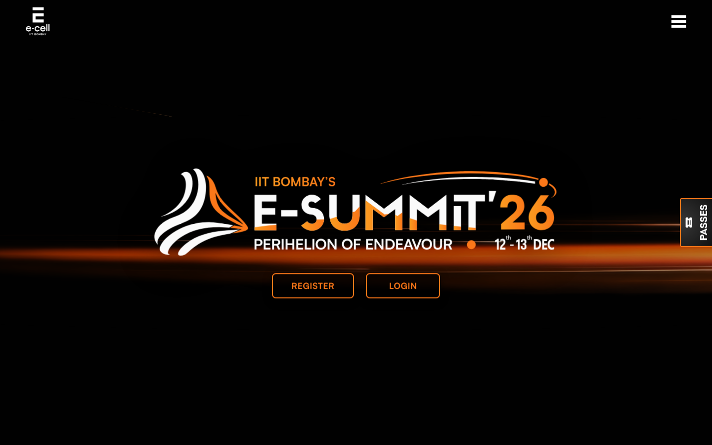

### 33% scroll depth

*Scroll position: 0px of 900px total*

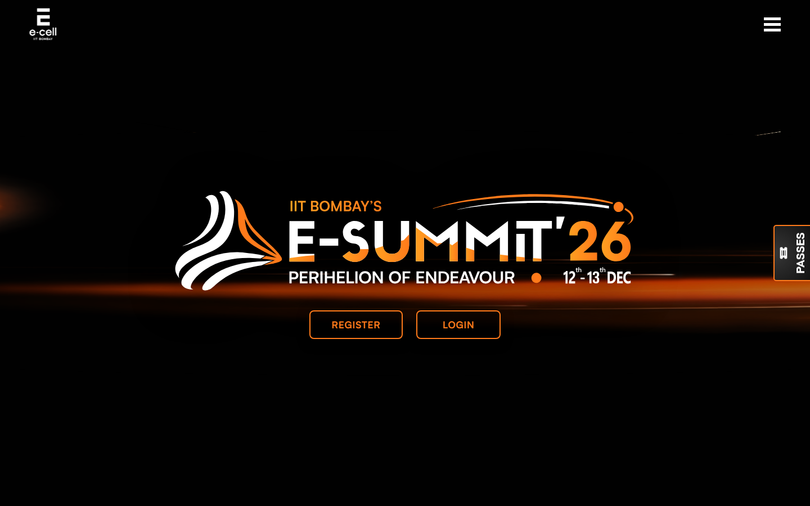

### 50% scroll depth

*Scroll position: 0px of 900px total*

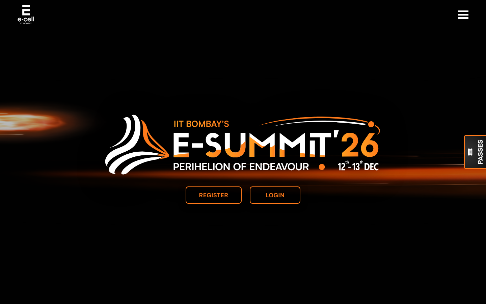

### 67% scroll depth

*Scroll position: 0px of 900px total*

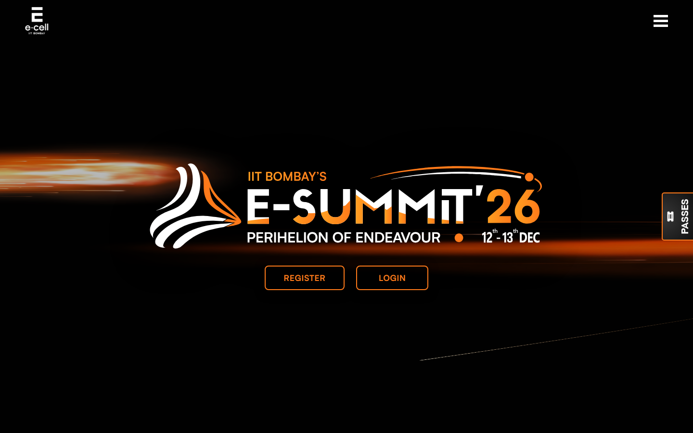

### 83% scroll depth

*Scroll position: 0px of 900px total*

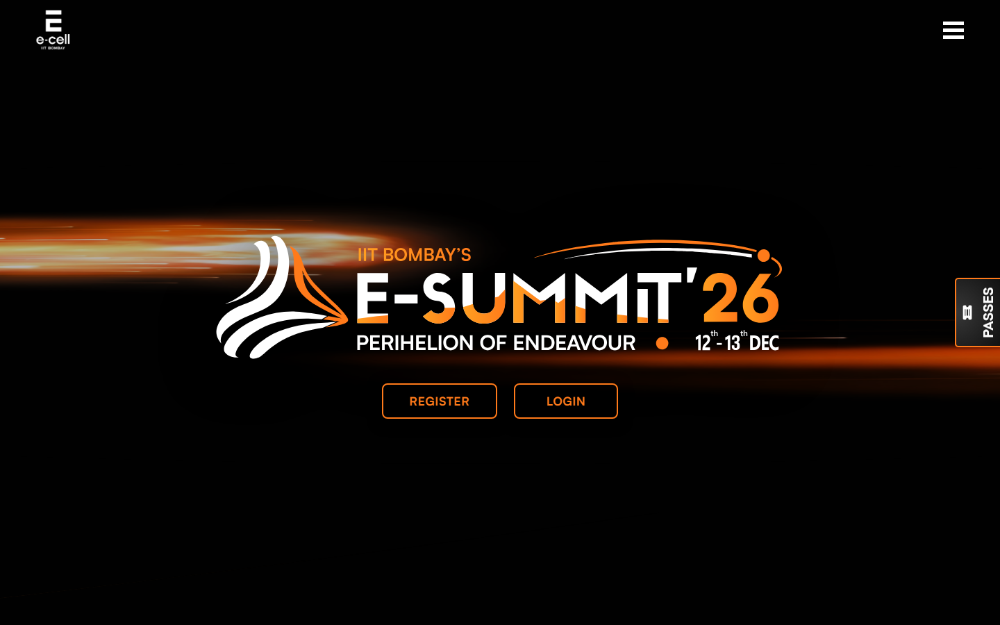

### Footer — End of page

*Scroll position: 0px of 900px total*

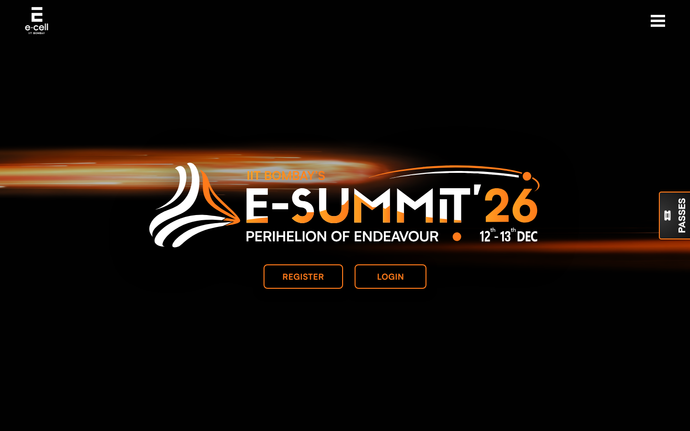

## Full Page Screenshots

### E-Summit 2026 | E-Cell IIT Bombay

*URL: `https://www.ecell.in/esummit/`*

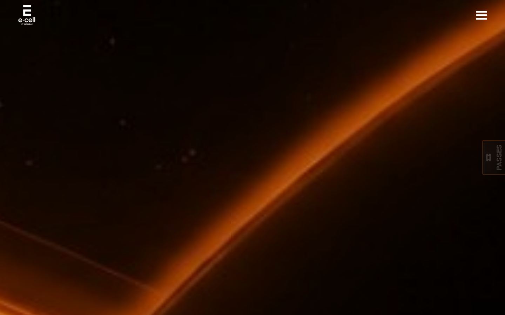

### E-Cell - Creating Job Creators

*URL: `https://www.ecell.in/`*

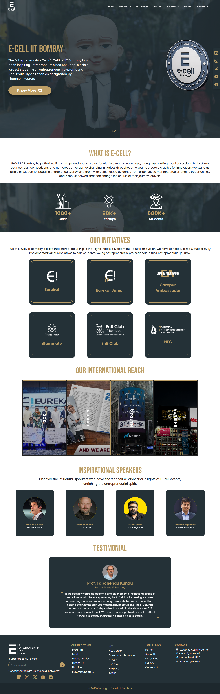

### Events | E-Summit 2026 | E-Cell IIT Bombay

*URL: `https://www.ecell.in/esummit/events`*

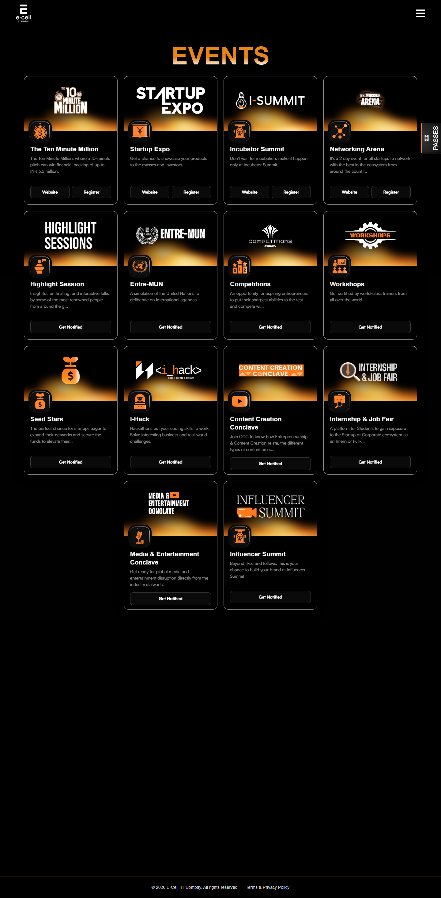

### Accommodation | E-Summit 2026 | E-Cell IIT Bombay

*URL: `https://www.ecell.in/esummit/acco`*

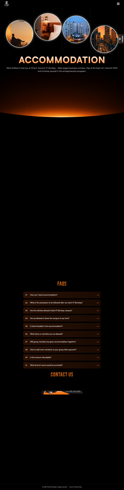

### Sponsors | E-Summit 2026 | E-Cell IIT Bombay

*URL: `https://www.ecell.in/esummit/sponsors`*

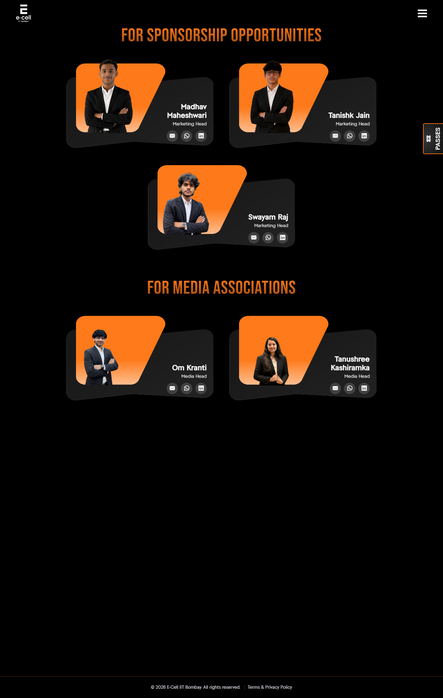

## Section Screenshots

Clipped sections showing individual components in context.

### Section 2 — `header`

*1440×900px*

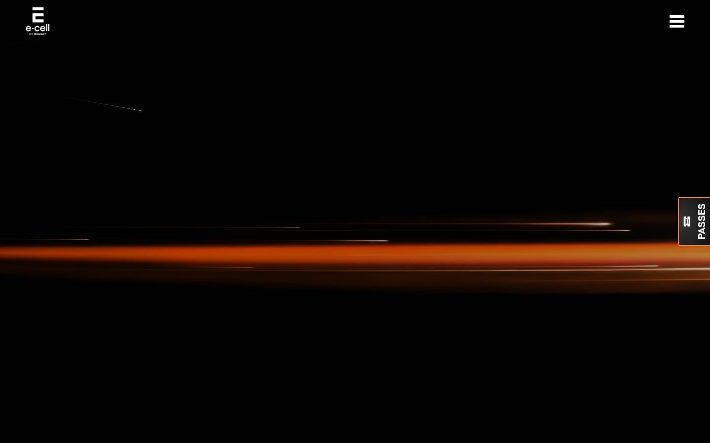

### Section 3 — `[class*="hero"]`

*1440×900px*

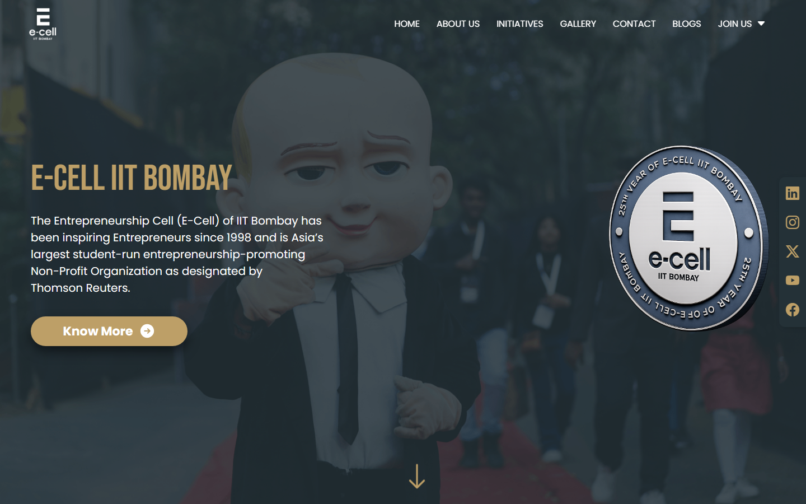

### Section 1 — `section`

*1400×1200px*

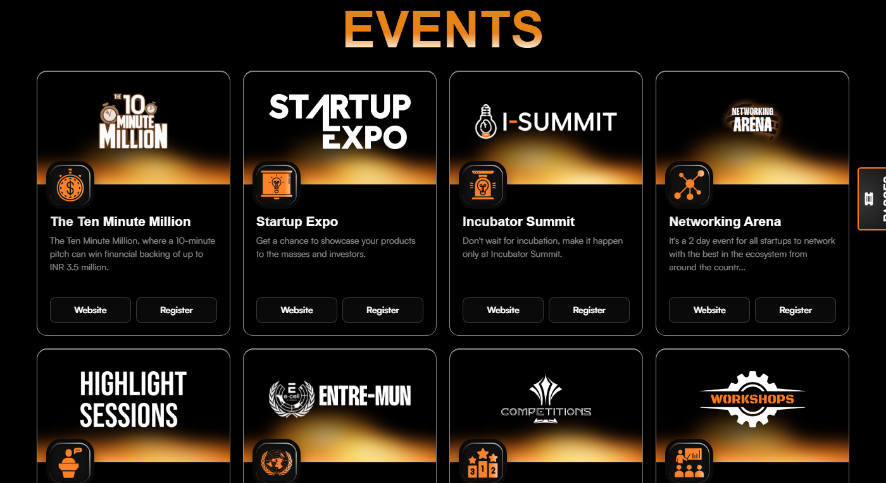

### Section 1 — `section`

*1440×1200px*

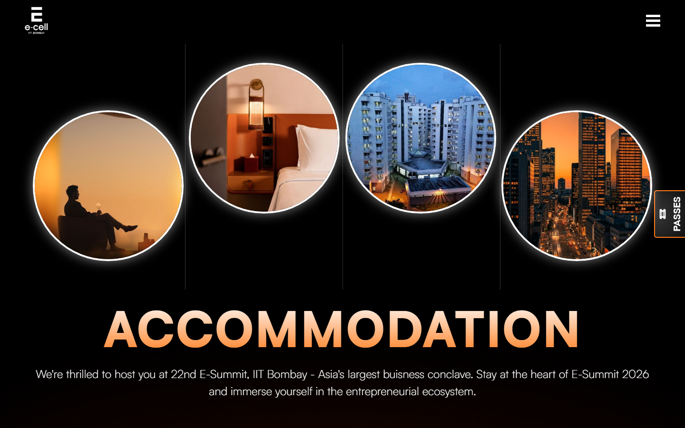

### Section 5 — `[class*="hero"]`

*1365×940px*

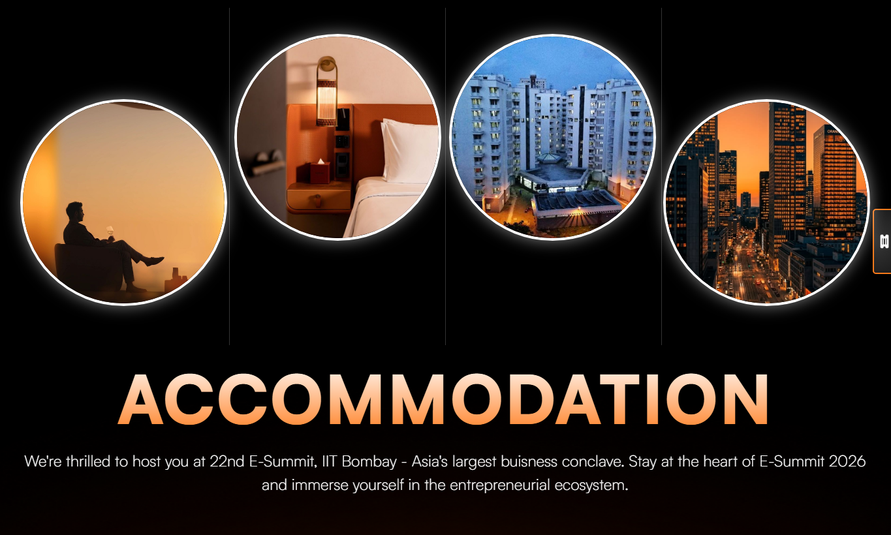

