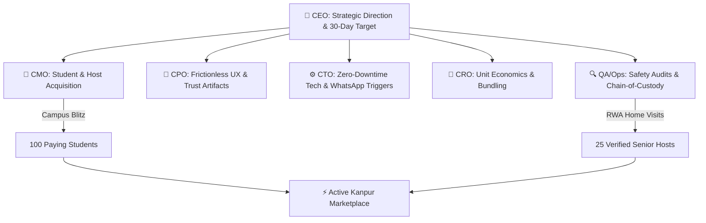
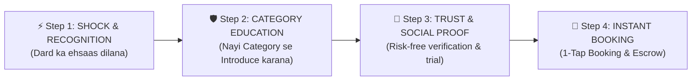

# StashSaarthi — Kanpur Market Launch Playbook & 0-to-1 Go-To-Market Strategy

> **Document Type:** Executive Strategy & Operational Launch Plan  
> **Prepared By:** CEO & AI Workforce Leadership Board (CTO, CMO, CPO, QA, CRO)  
> **Target Market:** Kanpur Academic Corridor (IIT Kanpur, CSJMU, HBTU, GSVM, Kakadeo)  
> **Primary Milestone:** 100 Paying Students + 25 Verified Senior Hosts within 30 Days  
> **Status:** Approved for Immediate Ground Execution

---

## 1. Executive Summary & CEO Vision

### The Problem We Are Solving in Kanpur

Every semester transition and summer break, **over 45,000 students** across IIT Kanpur, CSJMU, HBTU, and Kakadeo face a severe financial trap:

- **Dead-Rent Bleed:** Paying ₹4,000–₹8,000/month just to lock their luggage and mattresses in empty PG rooms during vacations.
- **Brokerage Exploitation:** Paying 1–2 months' rent (₹6,000–₹12,000) to local brokers for substandard student housing.
- **Tiffin Trauma:** Eating unhygienic, repetitive commercial mess food that causes digestive issues and academic burnout.

Simultaneously, **thousands of senior citizens** living in Kalyanpur, Kakadeo, Swaroop Nagar, and Ashok Nagar have empty spare rooms, verandahs, and corners, alongside unmatched culinary skills, but suffer from loneliness and fixed-pension inflation.

### The StashSaarthi Zero-CapEx Solution

1. **Saarthi Stash:** Micro-storage at **₹300/bag/month** (Saving students 85%+ vs. dead-rent; generating ₹1,800–₹6,000/mo passive income for hosts).
2. **Saarthi Spaces:** Zero-brokerage intergenerational living rooms at avg **₹5,500/month** with ₹0 broker cuts and verified guardian-like care.
3. **Saarthi Kitchen:** Pure, hygienic home-cooked meals (_Ghar Ka Khana_) at **₹90/meal or ₹2,400/month**.

---

## 2. C-Suite Leadership Board Meeting Minutes & Strategy Alignment



### 👑 CEO (Chief Executive Officer) — Orchestration & Milestone Charter

- **Primary Directive:** Achieve liquidity within 30 days. Liquidity means when a student requests storage or a room in Kalyanpur or Kakadeo, a verified host node is available within **1.2 km radius** with instant confirmation.
- **Founder Focus:** Do things that don't scale first — personally oversee the first 10 host home visits and first 25 luggage pickups to build ironclad ground trust.

### 📢 CMO (Chief Marketing Officer) — Hyper-Local Demand Generation

- **Angle 1: "The Dead-Rent Wakeup Call":** Contrast ₹6,000 PG vacation rent against ₹300 StashSaarthi micro-storage.
- **Angle 2: "Hostel WhatsApp Wing Takeover":** Deploy curated copy to unofficial WhatsApp/Telegram batch groups of IITK (Hall 1 to 14), CSJMU hostels, and HBTU East/West campuses.
- **Angle 3: "Campus Captains Network":** Recruit 5 high-influence student reps (1 per campus) incentivized with **₹50 instant cash reward per bag booked** + leadership credentials.
- **Angle 4: Offline Guerilla Infiltration:** High-contrast neon QR posters placed at Chai/Maggi points, xerox shops, and library gates in Kalyanpur and Kakadeo.

### 🎨 CPO (Chief Product Officer) — Frictionless UX & Physical Trust Touchpoints

- **Dual-Persona Interface:** Seamless toggle between Student Obsidian-Mint mode and Senior Host Warm-Amber mode.
- **Zero-Friction Booking:** Direct UPI QR dynamic simulator allowing 1-tap deep-linking into GPay, PhonePe, and Paytm.
- **Physical Trust Artifacts:**
  - Tamper-Evident Laser Barcode Seals with serial numbers.
  - Printable Dead-Rent Savings Audit Certificate for students.
  - Host "Saarthi Verification Shield" certificate (SS-AUTH-9204) for credibility.

### ⚙️ CTO (Chief Technology Officer) — Platform Reliability & Automation

- **High-Performance Architecture:** SSR + Nitro server compilation with 60–120 FPS hardware-accelerated animations and Lenis momentum scroll.
- **Instant Communication Loop:** Automated WhatsApp dispatch to `+91 9369454350` upon booking initiation with pre-populated order metadata.
- **Offline Reliability:** Instant local-storage caching for campus node availability radar and calculation states.

### 🎯 CRO (Chief Revenue Officer) — Unit Economics & Conversion Architecture

- **Kanpur Unit Economics (Locked Formulas):**
  - **Saarthi Stash (per bag/mo):** ₹300 Total = Host ₹180 (60%) + Logistics/Seal ₹40 (13.3%) + Platform Net Margin ₹80 (26.7%).
  - **Saarthi Spaces (per room/mo):** ₹5,500 Total = Host ₹5,225 + Student Fee (10% = ₹550) + Host Fee (5% = ₹275) - Payment Gateways = Platform Net Margin ₹700/mo.
  - **Saarthi Kitchen (per meal):** ₹90 Total = Host ₹55 + Delivery/Packaging ₹19 + Platform Net Margin ₹16/meal.
- **High-Converting Upsell Funnel:** "Book 2 Bags of Storage -> Get ₹300 Coupon on Saarthi Spaces or 3 Free Trial Home-Cooked Meals".

### 🔍 QA & Head of Operations — Safety Protocol & Chain of Custody

- **4-Tier Host Verification:** Aadhaar KYC + Police Clearance Record + Physical Premise Audit + RWA / Neighbor Reference Check.
- **Chain of Custody Guarantee:** Dual-signed physical inspection receipt + tamper-evident barcode seal + ₹10,000 security holding protection SLA.
- **Tuesday Escrow Payouts:** Direct NEFT/UPI settlement to hosts every Tuesday with 100% transparency.

---

## 3. Stage 0: Category Awareness & Trust Architecture (Pehle Awareness, Phir Trust, Phir Booking)

> **Founder Core Insight:** StashSaarthi is a completely **new category** in India. Students don't search for "elderly home micro-storage" because they don't even know this exists. Similarly, senior hosts don't know their spare room corner can safely generate ₹3,000–₹7,000/month. **We cannot directly sell a product without first educating the market and building unshakeable trust.**

### 🪜 The 3-Step Awareness-to-Trust Ladder



#### Step 1: Shock & Pain-Point Recognition (Dard ka Ehsaas)

- **For Students:** _"Kya aap vacation me 2 mahine empty room ka ₹12,000 rent sirf luggage ke liye de rahe ho?"_
  - **Emotional Trigger:** Loss aversion (Students hate throwing away hard-earned parent money on dead rent).
- **For Senior Hosts:** _"Ghar ka kamra ya verandah saalon se band hai, pension me mehangai badh rahi hai — kya aap safe, bina kisi disturbance ke ₹60,000/saal earn karna chahenge?"_
  - **Emotional Trigger:** Financial dignity + Respectful company without interference.

#### Step 2: Category Education (Explain the Concept in 5 Seconds)

- **Student Definition:** _"StashSaarthi is Kanpur's Student Locker Network — keep your bags safely in verified neighbor elderly homes at just ₹300/month with laser tamper seals."_
- **Senior Host Definition:** _"StashSaarthi is an IIT Bombay-validated community network that connects you with verified students from IIT Kanpur/CSJMU who need safe luggage storage during holidays."_

#### Step 3: Trust & Safety Proof (Overcoming Skepticism)

How do we eliminate fear ("Mera saamaan safe rahega?", "Host safe hai?", "Student koi gadbad toh nahi karega?"):

1. **Tamper-Evident Laser Barcode Seal:** Luggage gets sealed in front of the student. If seal breaks, ₹10,000 guarantee triggers.
2. **4-Tier Police & Aadhaar Verified Nodes:** Every host is Aadhaar KYC + Police clearance verified with Certificate ID: `SS-AUTH-9204`.
3. **Escrow Guarantee:** Student payment is held in escrow. Host is paid every Tuesday after safe custody.
4. **Institutional Backing:** Highlight **"Validated at IIT Bombay NEC 2026"** to give top-tier academic credibility.

---

## 4. The "Inbound Desire" Engine: How to Make People Crave the Service (Pull vs. Push)

> **Core Philosophy:** Instead of chasing consumers and convincing them, we trigger an emotional & financial realization so profound that they say: _"Ye service toh meri zindagi aasan kar degi — hume pehle hi book karna hai!"_

### 🔥 Dimension 1: Saarthi Stash (Storage Inbound Craving)

- **Student Trigger ("I NEED this before going home!"):**
  - **The "Dead-Rent Confession" Wall:** Anonymous forum thread on Kanpur student groups sharing horror stories of wasting ₹12,000–₹18,000 on vacation PG rent. Turns personal loss into a collective student rebellion where StashSaarthi is the heroic savior.
  - **Scarcity Waitlist:** _"Only 150 Storage Slots available in Phase 1 for Kalyanpur & Kakadeo. Lock your bag slot for ₹199 before slots run out."_
- **Senior Host Trigger ("Kone me chupchap paise ban rahe hain!"):**
  - **The "Sharma Ji" Tuesday Effect:** When the first 2 hosts get ₹3,000 Tuesday bank credits without anyone entering their personal rooms, they become viral ambassadors in morning walks & mandir sabhas.
  - **Saarthi Brass Shield Pride:** Certified hosts get the physical _"Verified Saarthi Safety Home 2026"_ plaque. Elders take pride in being community guardians.

---

### 🏠 Dimension 2: Saarthi Spaces (Zero-Brokerage Living Inbound Craving)

- **Student Trigger ("Bekaar commercial PG se azaadi!"):**
  - **The "Broker Loot" Relief:** Students dread paying ₹10,000 broker cuts for dingy 8x10 rooms with bad water and rude landlords.
  - **The Inbound Hook:** _"₹0 Brokerage, Green peaceful colony, Dadi-made breakfast, quiet study room with zero landlord drama at ₹5,500/mo."_ Students who visit once will literally plead to move in because it feels like a real home, not a commercial hostel.
- **Senior Host Trigger ("Ghar me ek shalin bachha ho toh akelepan ka darr nahi"):**
  - **Loneliness to Family Companion:** Many elders in Kanpur live alone in large 3BHK houses after children move abroad/Bangalore.
  - **The Inbound Hook:** _"Aapka beta/beti bahar hai. IIT/CSJMU ka ek sanskari, police-verified topper student aapke guest room me rahega. Aapko ₹6,000/mo aamdani bhi hogi aur emergency me phone milane ya dawa laane ke liye koi apna paas hoga."_ Elders crave this emotional security.

---

### 🍲 Dimension 3: Saarthi Kitchen (Ghar Ka Khana Inbound Craving)

- **Student Trigger ("Mess ke daal-paani se chhutkara!"):**
  - **The Mystery Tasting Drops:** Drop 50 hot, pure desi ghee sample tiffins (Paneer, Dal Tadka, Garam Phulke) in hostel common rooms.
  - **The Inbound Craving:** After eating oily hostel mess for 6 months, one bite of authentic home food triggers deep emotional homesickness and instant cravings. Students will flood WhatsApp: _"Bhai subscription ka link kahan hai?"_
- **Senior Host Trigger ("Mera banaya khana kisi bachhe ki tabiyat banaye"):**
  - Grandmothers in Kanpur love cooking but only cook for 1-2 people.
  - **The Inbound Hook:** _"Aunty, aap jo 2 extra thali banayengi, usse ek bahar se aaye bache ko bimari aur bahar ke khane se bachaya jayega, aur aapko mahine ke ₹4,000–₹6,000 sammanjanak aamdani milegi."_

---

### 🛡️ Dimension 4: Saarthi Trust & Family Peace of Mind (The Parent & NRI Child Craving)

- **Outstation Parent Trigger (Students' Parents in Bihar/Eastern UP/Delhi):**
  - **Parent Nightmare:** _"Mera 18 saal ka beta Kanpur me bheed aur akelepan me kahan rahega? Tabiyat kharab hui toh kaun dekhega?"_
  - **The Inbound Hook:** _"StashSaarthi means your child is not in an unregulated commercial trap; they are living with a verified retired professor/officer host family with 24/7 SOS safety backup."_ Parents will willingly demand their kids choose Saarthi Spaces.
- **NRI / Metro Children of Senior Hosts (Settled in Bangalore/US/Mumbai):**
  - **Working Child Nightmare:** _"Kanpur me Mummy-Papa akele rehte hain. Raat ko koi emergency ho gayi toh?"_
  - **The Inbound Hook:** _"StashSaarthi Family Dashboard connects your parents with verified polite student companions and a 15-minute emergency ground concierge network with live check-ins."_ Working kids will actively register their parents' homes.

---

### 🤝 Dimension 5: Saarthi Connect & Micro-Monetization (The Synergy Craving)

- **Interactive Compatibility Match:** Students and seniors matched on daily routine (early riser vs night owl, vegetarian diet, tech assistance).
- **Mutual Win:** Students help hosts set up WhatsApp video calls, pay electricity bills online, and order medicine on 1mg; Hosts provide mentorship, home remedies (_Kadha_ when sick), and uninterrupted quiet study ambiance.

---

## 5. Kanpur Awareness Guerrilla Campaign (Week 0 — The Pre-Launch Blitz)

### 1. The "Empty Suitcase" Guerilla Stunt (Kalyanpur & Kakadeo)

- **Concept:** Place a large locked suitcase on a small pedestal outside top Chai stalls / Maggi points near IIT Gate and Kakadeo Chhapeda Pulia.
- **Signboard on Suitcase:**
  > _"Main ek Suitcase hoon. Mere maalik ne vacation me mujhe rakhne ke liye ₹7,000 ka PG rent diya. 🤦‍♂️_  
  > _Kaash unhe pata hota ki **StashSaarthi** me main sirf **₹300/month** me safe rehta!_  
  > _Scan to know how: [QR Code to stashsaarthi.in]"_
- **Impact:** 100% stop-and-read rate, organic Instagram stories, viral word-of-mouth among hostellers.

### 2. WhatsApp Meme & Infographic Blitz in Batch Groups

- **Infographic:** "Kanpur Student Vacation Budget: Train Ticket ₹400 | Snacks ₹200 | Empty PG Dead-Rent ₹6,000 😭 vs StashSaarthi ₹300 🎉".
- Distributed across 50+ college & coaching WhatsApp groups through initial Campus Captains.

### 3. Senior Citizen "Chai Pe Charcha" in Kalyanpur & Swaroop Nagar

- Organize a 45-minute informal gathering at Buddha Park or community club with tea & samosas.
- Introduce StashSaarthi not as a "tech company", but as a **social initiative supporting Kanpur students while empowering local elders with respectful income**.

---

## 6. The 30-Day Step-by-Step Kanpur Launch Roadmap

```text
WEEK 1: SUPPLY SEEDING (Senior Host Onboarding)
├── Day 1-3: Target Kalyanpur, Kakadeo, & Swaroop Nagar RWA / Senior Citizen Clubs
├── Day 4-5: Conduct 25 physical home audits; issue official verified host certificates
└── Day 6-7: Calibrate host corner/verandah storage capacities (5–15 bags per home)

WEEK 2: CAMPUS CAPTAIN RECRUITMENT & DIGITAL SEEDING
├── Day 8-10: Onboard 5 Campus Captains across IITK, CSJMU, HBTU, GSVM, and Kakadeo
├── Day 11-12: Launch WhatsApp hostel group broadcast blitz with Dead-Rent Savings Calculator
└── Day 13-14: Place 200 QR stickers at high-traffic xerox/chai stalls near campus gates

WEEK 3: DEMAND EXPLOSION & CONVERSION BLITZ
├── Day 15-18: Launch Semester End / Vacation Storage pre-booking campaign
├── Day 19-21: First 50 student luggage pickups with Tamper-Evident laser seals
└── Day 22-24: Host-Student welcome calls and Saarthi Kitchen tiffin sample tasting

WEEK 4: REFERRAL FLYWHEEL & RETENTION LOCK-IN
├── Day 25-27: Execute "Refer a Roommate" campaign (₹100 discount + ₹50 captain bonus)
├── Day 28-29: Reconcile Tuesday host escrow payouts (100% on-time settlement)
└── Day 30: Publish Kanpur Case Study: "How Kanpur Students Saved ₹4.5 Lakhs in Dead-Rent"
```

---

## 7. How to Acquire the First 25 Senior Hosts (Supply Engine)

Senior hosts do not scroll Instagram for gig work; they respond to **respect, safety, social dignity, and transparent supplemental pension income**.

### Channel 1: Morning Walk & Temple Network Activation (Kalyanpur & Kakadeo)

- **Locations:** Buddha Park (Kalyanpur), Kakadeo Central Park, Radha Madhav Mandir, Swaroop Nagar Walker's Track.
- **Method:** Respectful, in-person conversations during morning hours (6:30 AM – 8:30 AM).
- **Pitch:** _"Namaste Uncle/Aunty, your children might be working in Delhi/Bangalore. You have clean spare space in your home. Respectful, verified students from IIT Kanpur and CSJMU need safe storage for 2 months. We do complete police verification, provide tamper-evident laser seals, and transfer ₹2,500 to ₹7,000 directly to your bank account every month without anyone disturbing your daily routine."_

### Channel 2: RWA & Pensioner Society Associations

- Present at Kalyanpur and Kakadeo Resident Welfare Association meetings with the **1-Page Senior Host Safety Charter**:
  - Zero intrusion into living rooms (storage confined to designated verandah/corner).
  - 100% control over house rules (no smoking, no late-night entry).
  - ₹10,000 comprehensive safety protection cover.

### Channel 3: Community Doctor & Pharmacy Referrals

- Place leaflets at local medical stores and clinics in Swaroop Nagar and Kalyanpur where senior citizens regularly purchase medicines.

---

## 8. How to Acquire the First 100 Students (Demand Engine)

### Channel 1: WhatsApp Hostel & PG Group Infiltration

- **Distribution:** Target student wing representatives, branch groups, and coaching batches.
- **Message Hook:**
  > _"Bhaiyon/Beheno, Summer Vacation or Coaching break me PG ka ₹6,000 dead rent dena band karo! 🛑_  
  > _StashSaarthi is live in Kanpur — verified elderly host homes me luggage secure rakho sirf **₹300/bag/month** me._  
  > _✅ Tamper-evident laser seal_  
  > _✅ ₹10,000 safety guarantee_  
  > _✅ 1 km from campus gate (Kalyanpur / Kakadeo)_  
  > _Calculate your savings & book on WhatsApp: https://stashsaarthi.in"_

### Channel 2: Xerox Shop & Tea Stall Point-of-Sale QR Code Placements

- Every college student visits the print/xerox shop before semester exams.
- Partner with top 10 photocopy shops in Kakadeo (near Chhapeda Pulie) and Kalyanpur (near IIT Gate):
  - Place a tabletop standee: _"Store your heavy luggage during vacation for ₹300/month instead of paying full PG rent. Scan to check nearest node."_
  - Give the shopkeeper **₹20 commission per scanned booking**.

### Channel 3: Campus Captain Incentive Engine

- Recruit 1 active student in each campus/hostel block:
  - **Incentive:** ₹50 instant UPI transfer per successful student booking.
  - **Milestone Bonus:** ₹1,000 cash prize + "Campus Growth Lead" Certificate for hitting 20 bookings.

---

## 9. Operational Fulfillment Playbook (The Ground Day-to-Day)

```text
[STUDENT BOOKS ONLINE / WHATSAPP]
       │
       ▼
[DISPATCH OPERATOR VERIFIES ON-GROUND CAPACITY]
       │
       ▼
[COLLECTION CONCIERGE ARRIVES WITH TAMPER SEALS]
  ├── Luggage weighed & photographed
  ├── Dual laser barcode seal applied (Seal #SS-KNP-XXXX)
  └── Student signs digital custody waiver
       │
       ▼
[SECURE PLACEMENT AT VERIFIED HOST CORNER]
  ├── Host signs receipt
  ├── Escrow holding locked
  └── Live photo confirmation sent to student
       │
       ▼
[VACATION OVER / RETRIEVAL]
  ├── Student inspects unbroken laser seal
  ├── 1-click confirmation release
  └── Weekly host payout settled via UPI/NEFT
```

---

## 10. Key Performance Indicators (KPIs) & Target Dashboard

| Metric                            | Target (Day 30)                    | Tracking Tool           | Owner   |
| :-------------------------------- | :--------------------------------- | :---------------------- | :------ |
| **Verified Senior Hosts**         | 25 Hosts (Kalyanpur/Kakadeo)       | Host CRM / Google Sheet | `@Ops`  |
| **Storage Capacity Available**    | 250 Bags                           | HostSimulator Node Map  | `@Tech` |
| **Paying Students Booked**        | 100 Students                       | Booking Engine / DB     | `@CRO`  |
| **Total Luggage Stashed**         | 160 Bags                           | Physical Audit Log      | `@Ops`  |
| **Gross Merchandise Value (GMV)** | ₹48,000 (Stash) + ₹55,000 (Spaces) | Financial Model         | `@CEO`  |
| **Net Platform Revenue**          | ₹12,800 (Stash) + ₹7,000 (Spaces)  | Stripe/Escrow Ledger    | `@CRO`  |
| **Host On-Time Payout Rate**      | 100% (Every Tuesday)               | Payout Ledger           | `@Ops`  |
| **Custody Incident Rate**         | 0.00% (Zero Seal Breaches)         | Safety Incident Log     | `@QA`   |

---

## 11. Immediate Action Items for Founders & Operators (Next 72 Hours)

1. **Step 1:** Print 50 copies of the **Senior Host Safety Charter** and 200 copies of the **Dead-Rent Student QR Flyer**.
2. **Step 2:** Visit Kalyanpur Buddha Park and Kakadeo Geeta Nagar morning walk tracks to onboard the first 5 anchor hosts.
3. **Step 3:** Order 500 numbered tamper-evident laser barcode sticker seals.
4. **Step 4:** Reach out to 5 student leaders at IIT Kanpur (Hall 2, Hall 3, Hall 5) and CSJMU to appoint them as initial Campus Captains.
5. **Step 5:** Route all live bookings via the dedicated hotline `+91 9369454350` and maintain real-time booking logs.

---

_Document approved and sealed by the StashSaarthi Executive AI Board on 2026-08-30._
