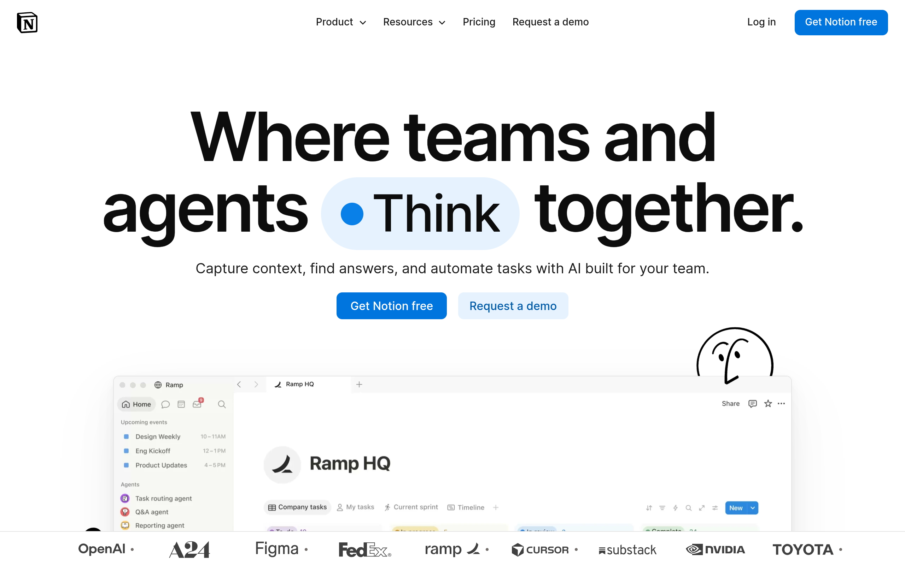

# notion Design System

You are building UI for **notion**. Light-themed, warm palette, sans-serif typography (Noto Sans Arabic), compact density on a 4px grid, expressive motion.

## Visual Reference

**IMPORTANT**: Study ALL screenshots below before writing any UI. Match colors, typography, spacing, layout, and motion exactly as shown.

### Homepage



> Read `references/DESIGN.md` for full token details.

## Design Philosophy

- **Layered depth** — use shadow tokens to create a sense of physical layering. Each elevation level has a specific shadow.
- **Gradient accents** — gradients are used thoughtfully for emphasis, not decoration.
- **Type pairing** — Noto Sans Arabic for body/UI text, NotionInter for headings/display. Never introduce a third typeface.
- **compact density** — 4px base grid. Every dimension is a multiple of 4.
- **warm palette** — the color temperature runs warm, matching the sans-serif typography.
- **Restrained accent** — `#ffb110` is the only pop of color. Used exclusively for CTAs, links, focus rings, and active states.
- **Expressive motion** — animations are an integral part of the experience. Use spring physics and layout animations.

## Color System

### Core Palette

| Role | Token | Hex | Use |
|------|-------|-----|-----|
| Background | `--background` | `#f9f9f8` | Page/app background |
| Text Primary | `--text-primary` | `#31302e` | Headings, body text |
| Text Muted | `--text-muted` | `#78736f` | Captions, placeholders |
| Accent | `--accent` | `#ffb110` | CTAs, links, focus rings |
| Border | `--border` | `#615d59` | Dividers, card borders |

### Status Colors

| Status | Hex | Use |
|--------|-----|-----|
| Success | `#1aae39` | Confirmations, positive trends |
| Warning | `#fff5e0` | Caution states, pending items |
| Danger | `#fdd3cd` | Errors, destructive actions |

### Extended Palette

- **tatami-color-black:** `#000000` — Deep background layer or shadow color
- **collection-block-background-color:** `#2383e2`
- **tatami-color-gray-900:** `#191918` — Deep background layer or shadow color
- **tatami-color-gray-300:** `#dfdcd9`
- **tatami-color-campaigns-dev-platform-dos-blue:** `#1313ba`
- **tatami-color-campaigns-dev-platform-dos-lavender:** `#cbcbef`
- **tatami-color-blue-200:** `#e6f3fe` — Light surface or highlight color
- **tatami-color-blue-500:** `#097fe8`

### CSS Variable Tokens

```css
--tatami-border-radius-0: 0;
--tatami-border-radius-200: .25rem;
--tatami-border-radius-300: .3125rem;
--tatami-border-radius-400: .375rem;
--tatami-border-radius-500: .5rem;
--tatami-border-radius-600: .625rem;
--tatami-border-radius-700: .75rem;
--tatami-border-radius-800: .875rem;
--tatami-border-radius-900: 1rem;
--tatami-border-radius-round: 624.938rem;
--tatami-border-width-1: var(--tatami-dimension-thickness-1);
--tatami-border-style-solid: solid;
--tatami-border-style-dashed: dashed;
--tatami-font-family-primary-sans: NotionInter;
--tatami-font-family-primary-serif: "Lyon Text";
--tatami-font-family-primary-serif-japanese: "Lyon Text";
--tatami-font-family-primary-serif-chinese-simplified: "Lyon Text";
--tatami-font-family-primary-serif-chinese-traditional: "Lyon Text";
--tatami-font-family-primary-sans-vietnamese: ui-sans-serif;
--tatami-font-family-primary-serif-vietnamese: ui-serif;
```

## Typography

### Font Stack

- **Noto Sans Arabic** — Heading 1, Heading 2, Heading 3
- **NotionInter** — Body, Caption
- **iA Writer Mono** — Code

### Font Sources

```css
@font-face {
  font-family: "NotionInter";
  src: url("fonts/NotionInter-Regular.woff2") format("woff2");
  font-weight: 400;
}
@font-face {
  font-family: "NotionInter";
  src: url("fonts/NotionInter-700.woff2") format("woff2");
  font-weight: 700;
}
@font-face {
  font-family: "Noto Sans Arabic";
  src: url("fonts/NotoSansArabic-Bold.ttf") format("truetype");
  font-weight: 700;
}
@font-face {
  font-family: "Noto Sans Arabic";
  src: url("fonts/NotoSansArabic-Regular.ttf") format("truetype");
  font-weight: 400;
}
@font-face {
  font-family: "Noto Sans Hebrew";
  src: url("fonts/NotoSansHebrew-Bold.ttf") format("truetype");
  font-weight: 700;
}
@font-face {
  font-family: "Noto Sans Hebrew";
  src: url("fonts/NotoSansHebrew-Regular.ttf") format("truetype");
  font-weight: 400;
}
@font-face {
  font-family: "Lyon Text";
  src: url("fonts/LyonText-Regular.woff2") format("woff2");
  font-weight: 400;
}
@font-face {
  font-family: "iA Writer Mono";
  src: url("fonts/iAWriterMono-Regular.woff2") format("woff2");
  font-weight: 400;
}
@font-face {
  font-family: "Permanent Marker";
  src: url("fonts/PermanentMarker-Regular.ttf") format("truetype");
  font-weight: 400;
}
```

### Type Scale

| Role | Family | Size | Weight |
|------|--------|------|--------|
| Heading 1 | Noto Sans Arabic | 85px | 700 |
| Heading 2 | Noto Sans Arabic | 78px | 700 |
| Heading 3 | Noto Sans Arabic | 68px | 700 |
| Body | NotionInter | 14px | 400 |
| Caption | NotionInter | 16px | 400 |
| Code | iA Writer Mono | 14px | 400 |

### Typography Rules

- Body/UI: **Noto Sans Arabic**, Headings: **NotionInter** — these are the only display fonts
- Max 3-4 font sizes per screen
- Headings: weight 600-700, body: weight 400
- Use color and opacity for text hierarchy, not additional font sizes
- Line height: 1.5 for body, 1.2 for headings

## Spacing & Layout

### Base Grid: 4px

Every dimension (margin, padding, gap, width, height) must be a multiple of **4px**.

### Spacing Scale

`2, 4, 6, 8, 10, 12, 14, 16, 18, 20, 22, 24` px

### Spacing as Meaning

| Spacing | Use |
|---------|-----|
| 4-8px | Tight: related items (icon + label, avatar + name) |
| 12-16px | Medium: between groups within a section |
| 24-32px | Wide: between distinct sections |
| 48px+ | Vast: major page section breaks |

### Border Radius

Scale: `inherit, .25rem, .5em, 1px, 2px, 3px, 3vw, 4px, 5px, 6px, 8px, 10px, 12px, 16px, 20px, 24px, 30px, 38px, 58px, 100%, 200px, 999px, 1000px, unset`
Default: `12px`

### Container

Max-width: `1392px`, centered with auto margins.

### Breakpoints

| Name | Value |
|------|-------|
| xs | 374px |
| xs | 375px |
| xs | 400px |
| xs | 440px |
| xs | 480px |
| sm | 599px |
| sm | 600px |
| md | 668px |
| md | 700px |
| md | 712px |
| md | 740px |
| md | 768px |
| lg | 799px |
| lg | 839px |
| lg | 840px |
| lg | 908px |
| lg | 919px |
| lg | 942px |
| lg | 960px |
| xl | 1032px |
| xl | 1080px |
| xl | 1120px |
| xl | 1156px |
| xl | 1200px |
| xl | 1280px |
| 2xl | 1300px |
| 2xl | 1440px |
| 2xl | 1600px |

Mobile-first: design for small screens, layer on responsive overrides.

## Component Patterns

### Card

```css
.card {
  background: #f9f9f8;
  border: 1px solid #615d59;
  border-radius: 12px;
  padding: 16px;
  box-shadow: var(--tatami-shadow-card-shadow);
}
```

```html
<div class="card">
  <h3>Card Title</h3>
  <p>Card content goes here.</p>
</div>
```

### Button

```css
/* Primary */
.btn-primary {
  background: #ffb110;
  color: #31302e;
  border-radius: 12px;
  padding: 8px 16px;
  font-weight: 500;
  transition: opacity 150ms ease;
}
.btn-primary:hover { opacity: 0.9; }

/* Ghost */
.btn-ghost {
  background: transparent;
  border: 1px solid #615d59;
  color: #31302e;
  border-radius: 12px;
  padding: 8px 16px;
}
```

```html
<button class="btn-primary">Get Started</button>
<button class="btn-ghost">Learn More</button>
```

### Input

```css
.input {
  background: #f9f9f8;
  border: 1px solid #615d59;
  border-radius: 12px;
  padding: 8px 12px;
  color: #31302e;
  font-size: 14px;
}
.input:focus { border-color: #ffb110; outline: none; }
```

```html
<input class="input" type="text" placeholder="Search..." />
```

### Badge / Chip

```css
.badge {
  display: inline-flex;
  align-items: center;
  padding: 4px 8px;
  border-radius: 9999px;
  font-size: 12px;
  font-weight: 500;
  background: #f9f9f8;
  color: #78736f;
}
```

```html
<span class="badge">New</span>
<span class="badge">Beta</span>
```

### Modal / Dialog

```css
.modal-backdrop { background: rgba(0, 0, 0, 0.6); }
.modal {
  background: #f9f9f8;
  border: 1px solid #615d59;
  border-radius: unset;
  padding: 24px;
  max-width: 480px;
  width: 90vw;
  box-shadow: 0 0 0 16px #2383e200;
}
```

```html
<div class="modal-backdrop">
  <div class="modal">
    <h2>Dialog Title</h2>
    <p>Dialog content.</p>
    <button class="btn-primary">Confirm</button>
    <button class="btn-ghost">Cancel</button>
  </div>
</div>
```

### Table

```css
.table { width: 100%; border-collapse: collapse; }
.table th {
  text-align: left;
  padding: 8px 12px;
  font-weight: 500;
  font-size: 12px;
  color: #78736f;
  text-transform: uppercase;
  letter-spacing: 0.05em;
  border-bottom: 1px solid #615d59;
}
.table td {
  padding: 12px;
  border-bottom: 1px solid #615d59;
}
```

```html
<table class="table">
  <thead><tr><th>Name</th><th>Status</th><th>Date</th></tr></thead>
  <tbody>
    <tr><td>Item One</td><td>Active</td><td>Jan 1</td></tr>
    <tr><td>Item Two</td><td>Pending</td><td>Jan 2</td></tr>
  </tbody>
</table>
```

### Navigation

```css
.nav {
  display: flex;
  align-items: center;
  gap: 8px;
  padding: 12px 16px;
  border-bottom: 1px solid #615d59;
}
.nav-link {
  color: #78736f;
  padding: 8px 12px;
  border-radius: 12px;
  transition: color 150ms;
}
.nav-link:hover { color: #31302e; }
.nav-link.active { color: #ffb110; }
```

```html
<nav class="nav">
  <a href="/" class="nav-link active">Home</a>
  <a href="/about" class="nav-link">About</a>
  <a href="/pricing" class="nav-link">Pricing</a>
  <button class="btn-primary" style="margin-left: auto">Get Started</button>
</nav>
```

### Extracted Components

These components were found in the codebase:

**Button** (`html`)

**Navigation** (`html`)

**Footer** (`html`)

## Page Structure

The following page sections were detected:

- **Navigation** — Top navigation bar (35 items)
- **Hero** — Hero/banner section with headline and CTAs
- **Footer** — Page footer with links and info (47 items)
- **Testimonials** — Testimonials/reviews section
- **Faq** — FAQ/accordion section

When building pages, follow this section order and structure.

## Animation & Motion

This project uses **expressive motion**. Animations are part of the design language.

### CSS Animations

- `fadeIn`
- `fadeOut`
- `scaleIn`
- `scaleOut`
- `popIn`

### Motion Tokens

- **Duration scale:** `0s`, `0ms`, `.01ms`, `1s`, `20ms`, `50ms`, `60ms`, `75ms`, `80ms`, `100ms`, `120ms`, `150ms`, `175ms`, `200ms`, `250ms`, `300ms`, `350ms`, `400ms`, `500ms`, `600ms`, `1000ms`
- **Easing functions:** `ease-in-out`, `linear`, `ease-in`, `cubic-bezier(.645,.045,.355,1)`, `ease-out`, `cubic-bezier(.16,1,.3,1)`, `cubic-bezier(.55,.085,.68,.53)`, `cubic-bezier(.215,.61,.355,1)`, `cubic-bezier(.4,0,.2,1)`, `ease`, `cubic-bezier(.6,.04,.98,.335)`

### Motion Guidelines

- **Duration:** Use values from the duration scale above. Short (0s) for micro-interactions, long (1000ms) for page transitions
- **Easing:** Use `ease-in-out` as the default easing curve
- **Direction:** Elements enter from bottom/right, exit to top/left
- **Reduced motion:** Always respect `prefers-reduced-motion` — disable animations when set

## Depth & Elevation

### Shadow Tokens

- Subtle: `0-1px #37352f17`
- Subtle: `inset -1px 0#00000005`
- Subtle: `inset 0 0 0 1px #0f0f0f1a`
- Subtle: `inset 1px 0#37352f29`
- Subtle: `inset 0 0 0 1px #2383e291,0 0 0 2px #2383e259`
- Subtle: `inset 0-1px 0 var(--tatami-color-border-base)`

### Z-Index Scale

`0, 1, 2, 3, 4, 5, 6, 7, 10, 50, 99, 100, 500, 1000, 10001, 99999`

Use these exact values — never invent z-index values.

## Anti-Patterns (Never Do)

- **No blur effects** — no backdrop-blur, no filter: blur()
- **No zebra striping** — tables and lists use borders for separation
- **No invented colors** — every hex value must come from the palette above
- **No arbitrary spacing** — every dimension is a multiple of 4px
- **No extra fonts** — only Noto Sans Arabic and NotionInter and iA Writer Mono are allowed
- **No arbitrary border-radius** — use the scale: .25rem, .5em, 1px, 2px, 3px, 4px, 5px, 6px, 8px, 10px
- **No opacity for disabled states** — use muted colors instead

## Workflow

1. **Read** `references/DESIGN.md` before writing any UI code
2. **Pick colors** from the Color System section — never invent new ones
3. **Set typography** — Noto Sans Arabic, NotionInter, iA Writer Mono only, using the type scale
4. **Build layout** on the 4px grid — check every margin, padding, gap
5. **Match components** to patterns above before creating new ones
6. **Apply elevation** — use shadow tokens
7. **Validate** — every value traces back to a design token. No magic numbers.

## Brand Spec

- **Favicon:** `/front-static/favicon.ico`
- **Site URL:** `https://notion.so`
- **Brand color:** `#ffb110`
- **Brand typeface:** Noto Sans Arabic

## Quick Reference

```
Background:     #f9f9f8
Surface:        (not extracted)
Text:           #31302e / #78736f
Accent:         #ffb110
Border:         #615d59
Font:           Noto Sans Arabic
Spacing:        4px grid
Radius:         12px
Components:     7 detected
```

## When to Trigger

Activate this skill when:
- Creating new components, pages, or visual elements for notion
- Writing CSS, Tailwind classes, styled-components, or inline styles
- Building page layouts, templates, or responsive designs
- Reviewing UI code for design consistency
- The user mentions "notion" design, style, UI, or theme
- Generating mockups, wireframes, or visual prototypes

---

# Full Reference Files

> Every output file is embedded below. Claude has full design system context from /skills alone.

## Design System Tokens (DESIGN.md)

# notion DESIGN.md

> Auto-generated design system — reverse-engineered via static analysis by skillui.
> Frameworks: None detected
> Colors: 20 · Fonts: 3 · Components: 7
> Icon library: not detected · State: not detected
> Primary theme: light · Dark mode toggle: no · Motion: expressive

## Visual Reference

**Match this design exactly** — study colors, fonts, spacing, and component shapes before writing any UI code.


---

## 1. Visual Theme & Atmosphere

This is a **light-themed** interface with a warm, approachable feel. The light background emphasizes content clarity. Typography pairs **NotionInter** for display/headings with **Noto Sans Arabic** for body text, creating clear visual hierarchy through type contrast. Spacing follows a **4px base grid** (compact density), with scale: 2, 4, 6, 8, 10, 12, 14, 16px. The accent color **#ffb110** anchors interactive elements (buttons, links, focus rings). Motion is expressive — spring physics, layout animations, and staggered reveals are part of the visual language.

---

## 2. Color Palette & Roles

| Token | Hex | Role | Use |
|---|---|---|---|
| tatami-color-gray-100 | `#f9f9f8` | background | Page background, darkest surface |
| tatami-color-gray-800 | `#31302e` | text-primary | Headings and body text |
| tatami-color-gray-500 | `#78736f` | text-muted | Captions, placeholders, secondary info |
| tatami-color-gray-600 | `#615d59` | border | Dividers, card borders, outlines |
| tatami-color-yellow-500 | `#ffb110` | accent | CTAs, links, focus rings, active states |
| tatami-color-red-200 | `#fdd3cd` | danger | Error states, destructive actions |
| tatami-color-green-500 | `#1aae39` | success | Success states, positive indicators |
| tatami-color-yellow-100 | `#fff5e0` | warning | Warning states, caution indicators |
| collection-block-background-color | `#2383e2` | info | Informational highlights |
| tatami-color-black | `#000000` | unknown | Palette color |
| tatami-color-gray-900 | `#191918` | unknown | Palette color |
| tatami-color-gray-300 | `#dfdcd9` | unknown | Palette color |
| tatami-color-campaigns-dev-platform-dos-blue | `#1313ba` | unknown | Palette color |
| tatami-color-campaigns-dev-platform-dos-lavender | `#cbcbef` | unknown | Palette color |
| tatami-color-blue-200 | `#e6f3fe` | unknown | Palette color |
| tatami-color-blue-500 | `#097fe8` | unknown | Palette color |
| tatami-color-red-500 | `#f64932` | unknown | Palette color |
| tatami-color-gray-400 | `#a39e98` | unknown | Palette color |
| tatami-color-gray-700 | `#494744` | unknown | Palette color |
| tatami-color-red-300 | `#ff8b7c` | unknown | Palette color |

### CSS Variable Tokens

```css
--tatami-border-radius-0: 0;
--tatami-border-radius-200: .25rem;
--tatami-border-radius-300: .3125rem;
--tatami-border-radius-400: .375rem;
--tatami-border-radius-500: .5rem;
--tatami-border-radius-600: .625rem;
--tatami-border-radius-700: .75rem;
--tatami-border-radius-800: .875rem;
--tatami-border-radius-900: 1rem;
--tatami-border-radius-round: 624.938rem;
--tatami-border-width-1: var(--tatami-dimension-thickness-1);
--tatami-border-style-solid: solid;
--tatami-border-style-dashed: dashed;
--tatami-font-family-primary-sans: NotionInter;
--tatami-font-family-primary-serif: "Lyon Text";
--tatami-font-family-primary-serif-japanese: "Lyon Text";
--tatami-font-family-primary-serif-chinese-simplified: "Lyon Text";
--tatami-font-family-primary-serif-chinese-traditional: "Lyon Text";
--tatami-font-family-primary-sans-vietnamese: ui-sans-serif;
--tatami-font-family-primary-serif-vietnamese: ui-serif;
```


---

## 3. Typography Rules

**Font Stack:**
- **Noto Sans Arabic** — Heading 1, Heading 2, Heading 3
- **NotionInter** — Body, Caption
- **iA Writer Mono** — Code

**Font Sources:**

```css
@font-face {
  font-family: "NotionInter";
  src: url("fonts/NotionInter-Regular.woff2") format("woff2");
  font-weight: 400;
}
@font-face {
  font-family: "NotionInter";
  src: url("fonts/NotionInter-700.woff2") format("woff2");
  font-weight: 700;
}
@font-face {
  font-family: "Noto Sans Arabic";
  src: url("fonts/NotoSansArabic-Bold.ttf") format("truetype");
  font-weight: 700;
}
@font-face {
  font-family: "Noto Sans Arabic";
  src: url("fonts/NotoSansArabic-Regular.ttf") format("truetype");
  font-weight: 400;
}
@font-face {
  font-family: "Noto Sans Hebrew";
  src: url("fonts/NotoSansHebrew-Bold.ttf") format("truetype");
  font-weight: 700;
}
@font-face {
  font-family: "Noto Sans Hebrew";
  src: url("fonts/NotoSansHebrew-Regular.ttf") format("truetype");
  font-weight: 400;
}
@font-face {
  font-family: "Lyon Text";
  src: url("fonts/LyonText-Regular.woff2") format("woff2");
  font-weight: 400;
}
@font-face {
  font-family: "iA Writer Mono";
  src: url("fonts/iAWriterMono-Regular.woff2") format("woff2");
  font-weight: 400;
}
@font-face {
  font-family: "Permanent Marker";
  src: url("fonts/PermanentMarker-Regular.ttf") format("truetype");
  font-weight: 400;
}
```

| Role | Font | Size | Weight |
|---|---|---|---|
| Heading 1 | Noto Sans Arabic | 85px | 700 |
| Heading 2 | Noto Sans Arabic | 78px | 700 |
| Heading 3 | Noto Sans Arabic | 68px | 700 |
| Body | NotionInter | 14px | 400 |
| Caption | NotionInter | 16px | 400 |
| Code | iA Writer Mono | 14px | 400 |

**Typographic Rules:**
- Limit to 3 font families max per screen
- Use **Noto Sans Arabic** for body/UI text, **NotionInter** for display/headings
- Maintain consistent hierarchy: no more than 3-4 font sizes per screen
- Headings use bold (600-700), body uses regular (400)
- Line height: 1.5 for body text, 1.2 for headings
- Use color and opacity for secondary hierarchy, not additional font sizes


---

## 4. Component Stylings

### Layout (1)

**Footer** — `html`

### Navigation (1)

**Navigation** — `html`

### Data Display (1)

**Badge** — `html`

### Data Input (2)

**Button** — `html`
- Animation: 

**Input** — `html`
- State: :focus, :placeholder

### Media (2)

**Image** — `html`

**Icon** — `html`


---

## 5. Layout Principles

- **Base spacing unit:** 4px
- **Spacing scale:** 2, 4, 6, 8, 10, 12, 14, 16, 18, 20, 22, 24
- **Border radius:** inherit, .25rem, .5em, 1px, 2px, 3px, 3vw, 4px, 5px, 6px, 8px, 10px, 12px, 16px, 20px, 24px, 30px, 38px, 58px, 100%, 200px, 999px, 1000px, unset
- **Max content width:** 1392px

**Spacing as Meaning:**
| Spacing | Use |
|---|---|
| 4-8px | Tight: related items within a group |
| 12-16px | Medium: between groups |
| 24-32px | Wide: between sections |
| 48px+ | Vast: major section breaks |


---

## 6. Depth & Elevation

### Flat — subtle depth hints

- `0-1px #37352f17`
- `inset -1px 0#00000005`
- `inset 0 0 0 1px #0f0f0f1a`

### Raised — cards, buttons, interactive elements

- `var(--tatami-shadow-card-shadow)`
- `var(--block-media-box-shadow)`
- `var(--tatami-shadow-screenshot-shadow)`

### Floating — dropdowns, popovers, modals

- `0 0 0 16px #2383e200`
- `0 3px 9px #0000,0 .7px 1.4625px #0000`
- `0-8px 16px -8px #00000014`

### Overlay — full-screen overlays, top-level dialogs

- `0 4px 18px #0000000a,0 2.025px 7.84688px #00000007,0 .8px 2.925px #00000005,0 .175px 1.04062px #00000003`
- `0 1px 3px #00000003,0 3px 7px #00000005,0 7px 15px #00000005,0 14px 28px #0000000a,0 23px 52px #0000000d`
- `0 4px 18px #0000000a,0 2.025px 7.84688px #00000007,0 .8px 2.925px #00000005,0 .175px 1.04062px #00000003,0 0 1px #fff9`

### Z-Index Scale

`0, 1, 2, 3, 4, 5, 6, 7, 10, 50, 99, 100, 500, 1000, 10001, 99999`


---

## 7. Animation & Motion

This project uses **expressive motion**. Animations are an integral part of the experience.

### CSS Animations

- `@keyframes fadeIn`
- `@keyframes fadeOut`
- `@keyframes scaleIn`
- `@keyframes scaleOut`
- `@keyframes popIn`
- `@keyframes rotate`
- `@keyframes index-module-scss-module__HZmsMG__pulse`
- `@keyframes popover-module-scss-module__njy5Hq__popoverFadeIn`

### Animated Components

- **Button**: 

### Motion Guidelines

- Duration: 150-300ms for micro-interactions, 300-500ms for page transitions
- Easing: `ease-out` for enters, `ease-in` for exits
- Always respect `prefers-reduced-motion`


---

## 8. Do's and Don'ts

### Do's

- Use `#ffb110` for interactive elements (buttons, links, focus rings)
- Use `#f9f9f8` as the primary page background
- Pair **Noto Sans Arabic** (body) with **NotionInter** (display) — these are the only allowed fonts
- Follow the **4px** spacing grid for all margins, padding, and gaps
- Use the defined shadow tokens for elevation — see Section 6
- Use border-radius from the scale: inherit, .25rem, .5em, 1px, 2px
- Reuse existing components from Section 4 before creating new ones

### Don'ts

- Don't introduce colors outside this palette — extend the design tokens first
- Don't introduce additional font families beyond Noto Sans Arabic and NotionInter and iA Writer Mono
- Don't use arbitrary spacing values — stick to multiples of 4px
- Don't create custom box-shadow values outside the system tokens
- Don't use arbitrary border-radius values — pick from the defined scale
- Don't duplicate component patterns — check Section 4 first
- Don't use backdrop-blur or blur effects

### Anti-Patterns (detected from codebase)

- No blur or backdrop-blur effects
- No zebra striping on tables/lists


---

## 9. Responsive Behavior

| Name | Value | Source |
|---|---|---|
| xs | 374px | css |
| xs | 375px | css |
| xs | 400px | css |
| xs | 440px | css |
| xs | 480px | css |
| sm | 599px | css |
| sm | 600px | css |
| md | 668px | css |
| md | 700px | css |
| md | 712px | css |
| md | 740px | css |
| md | 768px | css |
| lg | 799px | css |
| lg | 839px | css |
| lg | 840px | css |
| lg | 908px | css |
| lg | 919px | css |
| lg | 942px | css |
| lg | 960px | css |
| xl | 1032px | css |
| xl | 1080px | css |
| xl | 1120px | css |
| xl | 1156px | css |
| xl | 1200px | css |
| xl | 1280px | css |
| 2xl | 1300px | css |
| 2xl | 1440px | css |
| 2xl | 1600px | css |

**Approach:** Use `@media (min-width: ...)` queries matching the breakpoints above.


---

## 10. Agent Prompt Guide

Use these as starting points when building new UI:

### Build a Card

```
Background: #f9f9f8
Border: 1px solid #615d59
Radius: 12px
Padding: 16px
Font: Noto Sans Arabic
Use shadow tokens from Section 6.
```

### Build a Button

```
Primary: bg #ffb110, text white
Ghost: bg transparent, border #615d59
Padding: 8px 16px
Radius: 12px
Hover: opacity 0.9 or lighter shade
Focus: ring with #ffb110
```

### Build a Page Layout

```
Background: #f9f9f8
Max-width: 1392px, centered
Grid: 4px base
Responsive: mobile-first, breakpoints from Section 9
```

### Build a Stats Card

```
Surface: #f9f9f8
Label: #78736f (muted, 12px, uppercase)
Value: #31302e (primary, 24-32px, bold)
Status: use success/warning/danger from Section 2
```

### Build a Form

```
Input bg: #f9f9f8
Input border: 1px solid #615d59
Focus: border-color #ffb110
Label: #78736f 12px
Spacing: 16px between fields
Radius: 12px
```

### General Component

```
1. Read DESIGN.md Sections 2-6 for tokens
2. Colors: only from palette
3. Font: Noto Sans Arabic, type scale from Section 3
4. Spacing: 4px grid
5. Components: match patterns from Section 4
6. Elevation: shadow tokens
```

## Bundled Fonts (fonts/)

The following font files are bundled in the `fonts/` directory:

- `fonts/iAWriterMono-600.woff`
- `fonts/iAWriterMono-600.woff2`
- `fonts/iAWriterMono-Regular.woff`
- `fonts/iAWriterMono-Regular.woff2`
- `fonts/LyonText-600.woff`
- `fonts/LyonText-600.woff2`
- `fonts/LyonText-Regular.woff`
- `fonts/LyonText-Regular.woff2`
- `fonts/NotionInter-500.woff`
- `fonts/NotionInter-500.woff2`
- `fonts/NotionInter-600.woff`
- `fonts/NotionInter-600.woff2`
- `fonts/NotionInter-700.woff`
- `fonts/NotionInter-700.woff2`
- `fonts/NotionInter-Regular.woff`
- `fonts/NotionInter-Regular.woff2`
- `fonts/NotoSansArabic-Black.ttf`
- `fonts/NotoSansArabic-Bold.ttf`
- `fonts/NotoSansArabic-ExtraBold.ttf`
- `fonts/NotoSansArabic-ExtraLight.ttf`
- `fonts/NotoSansArabic-Light.ttf`
- `fonts/NotoSansArabic-Medium.ttf`
- `fonts/NotoSansArabic-Regular.ttf`
- `fonts/NotoSansArabic-SemiBold.ttf`
- `fonts/NotoSansArabic-Thin.ttf`
- `fonts/NotoSansHebrew-Black.ttf`
- `fonts/NotoSansHebrew-Bold.ttf`
- `fonts/NotoSansHebrew-ExtraBold.ttf`
- `fonts/NotoSansHebrew-ExtraLight.ttf`
- `fonts/NotoSansHebrew-Light.ttf`
- `fonts/NotoSansHebrew-Medium.ttf`
- `fonts/NotoSansHebrew-Regular.ttf`
- `fonts/NotoSansHebrew-SemiBold.ttf`
- `fonts/NotoSansHebrew-Thin.ttf`
- `fonts/PermanentMarker-Regular.ttf`

Use these local font files in `@font-face` declarations instead of fetching from Google Fonts.

## Homepage Screenshots (screenshots/)


